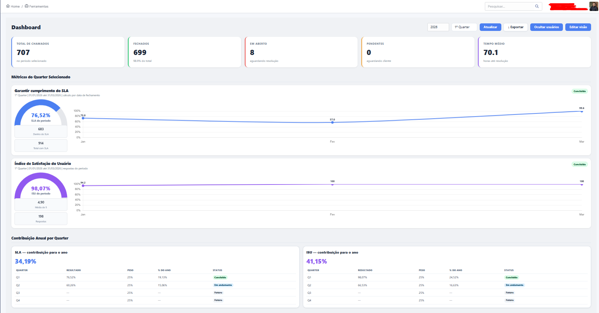
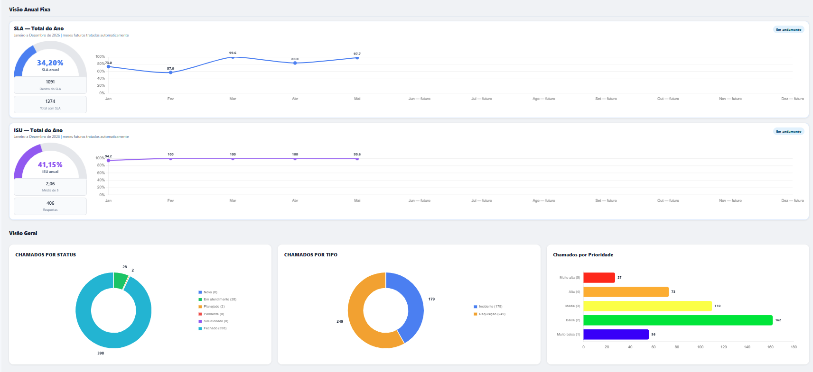
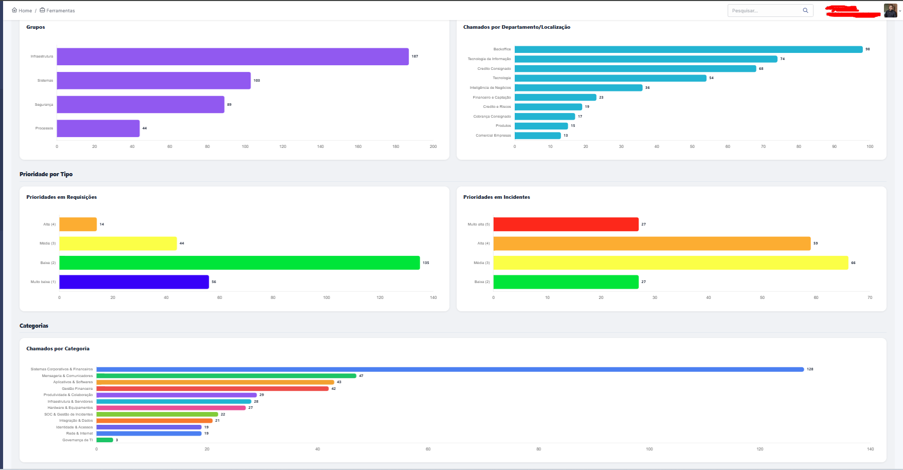
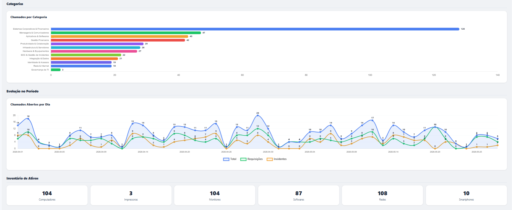
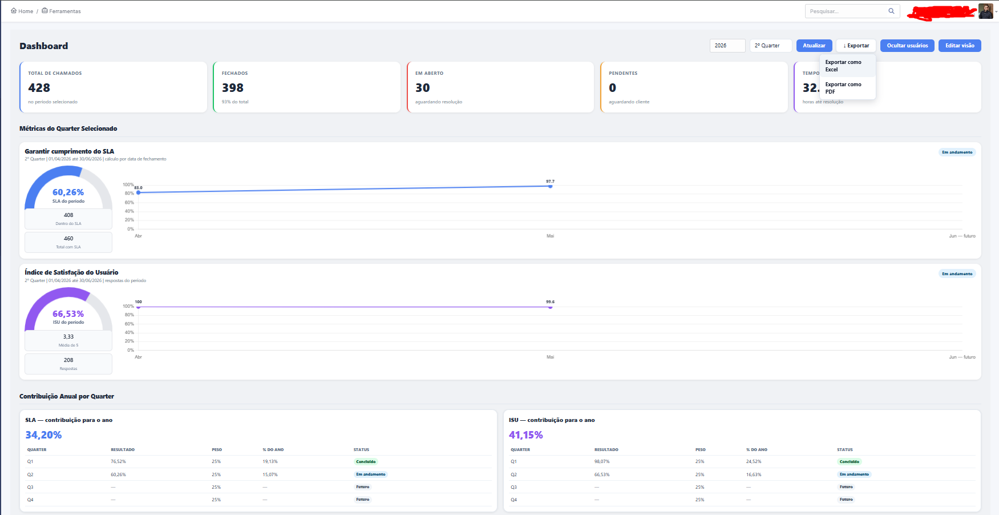
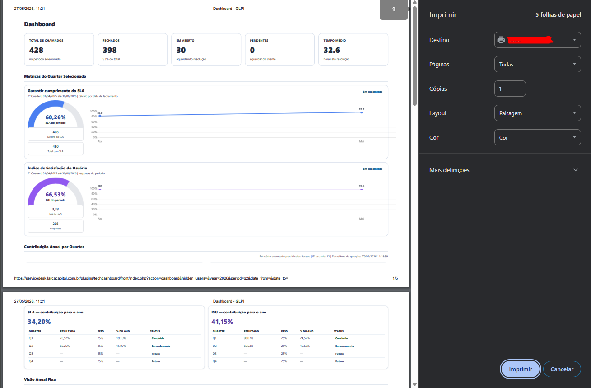

# TechDashboard for GLPI


White-label plugin for GLPI featuring operational dashboards, SLA/ISU metrics, reporting exports, service account filtering and company visual customization.

Compatible with **GLPI 10.x**, **PHP 8.1+** and **MariaDB/MySQL**.

---

## Features

- Operational ticket dashboard with KPIs, charts and historical evolution.
- Quarterly metrics (Quarter / Q1–Q4 model).
- Annual contribution calculation by quarter.
- Service / automation user exclusion from metrics.
- Auto-selection button for accounts titled **"Service Account"** or **"Service Accounts"**.
- PDF and CSV export (Excel compatible).
- Export audit footer with user and timestamp.
- User-reorganizable dashboard layout.
- GLPI-aligned priority color mapping.
- White-label branding:
  - Company name
  - Dashboard title
  - Logo upload
  - Custom colors

---

## Screenshots

### Dashboard Overview



### Dashboard — Extended View



### Governance



### Branding Configuration



### Report Export



### PDF Export Example



## Project Structure

```text
techdashboard/
├── assets/
│   └── default-logo.svg
├── css/
│   └── dashboard.css
├── docs/
├── front/
│   ├── config.form.php
│   └── index.php
├── inc/
│   ├── branding.class.php
│   └── dashboard.class.php
├── js/
│   └── dashboard.js
├── src/
│   └── Dashboard.php
├── uploads/
├── hook.php
├── setup.php
├── README.md
├── LICENSE
└── CHANGELOG.md
```

---

## Quick Installation

```bash
cd /var/www/html/glpi/plugins

git clone https://github.com/Nicolas-passos/Dashboard-Tecnico---techdashboard.git

sudo chown -R www-data:www-data techdashboard

sudo -u www-data php /var/www/html/glpi/bin/console cache:clear

sudo systemctl restart apache2
```

Then access GLPI as administrator:

```text
Setup → Plugins → TechDashboard → Install → Enable
```

---

## Branding / Company Logo

The plugin does **not include fixed company branding**.

To configure your own branding:

```text
Setup → Plugins → TechDashboard → Configure
```

Available options:

- Company Name
- Dashboard Title
- Enable Logo
- Logo Upload
- Primary Color
- Secondary Color

Supported formats:

```text
PNG
JPG
SVG
WEBP
```

See:

```text
docs/BRANDING.md
```

---

## Documentation

| File | Description |
|------|------|
| docs/INSTALL.md | Installation & updates |
| docs/CONFIGURACAO.md | Plugin configuration |
| docs/BRANDING.md | Branding configuration |
| docs/METRICAS.md | SLA, ISU & quarter rules |
| docs/EXPORTACAO.md | PDF, CSV & audit exports |
| docs/CUSTOMIZACAO.md | Adding KPIs & charts |
| docs/ARQUITETURA.md | Technical architecture |
| docs/TROUBLESHOOTING.md | Common issues |
| docs/MANUAL_USUARIO.md | User manual |
| docs/MANUAL_ADMINISTRADOR.md | Admin manual |

---
# Service Accounts / Contas de Serviço

## Overview

TechDashboard supports filtering of **service users**, **automation accounts**, **technical users** and **system integrations** from dashboard metrics.

This prevents SLA, ISU, KPIs and operational indicators from being distorted by bots, APIs, scheduled jobs and non-human accounts.

---

## Information Sources

The plugin retrieves service-account information directly from native GLPI data.

Main sources:

```text
glpi_users
glpi_usertitles
glpi_profiles_users
```

Depending on the GLPI configuration.

---

## Detection Methods

### 1. Manual User Selection

Administrators can manually choose which accounts should be excluded from metrics.

Path:

```text
Setup → Plugins → TechDashboard → Hide Users
```

Users selected here will not be considered in dashboard calculations.

---

### 2. Automatic Title Detection

TechDashboard includes an automatic helper button that searches users by **GLPI User Title**.

Supported title matching:

```text
Service Account
Service Accounts
Conta de Serviço
Contas de Serviço
```

Matching users can be automatically selected for exclusion.

---

## Recommended Configuration

Recommended best practice:

Create a dedicated **User Title** inside GLPI for technical accounts.

Examples:

```text
Service Account
Conta de Serviço
```

Then assign this title to:

- API integrations
- automation users
- bots
- monitoring accounts
- scheduled jobs
- cron users
- background processes
- system connectors

---

## Creating a Service Account Title in GLPI

Path:

```text
Administration → Dropdowns → User Titles
```

Create a new title:

```text
Service Account
```

or

```text
Conta de Serviço
```

Save.

---

## Assigning the Title to Users

Path:

```text
Administration → Users
```

Open the target account.

Locate the field:

```text
Title
```

Assign:

```text
Service Account
```

Save.

---

## Using Automatic Selection in TechDashboard

After configuring GLPI titles:

Open:

```text
TechDashboard → Hide Users
```

Click:

```text
Auto Select Service Accounts
```

The plugin will automatically search for matching accounts and pre-select them.

---

## Example Accounts

Typical accounts frequently excluded from metrics:

```text
zabbix
n8n
api_integracao
automation_user
monitoring_bot
backup_runner
glpi_cron
service_connector
system_bot
```

---

## Best Practices

Recommended operational practices:

✓ separate human users from technical users.

✓ maintain a dedicated title for service accounts.

✓ periodically review excluded users.

✓ document automation accounts internally.

✓ avoid using administrator accounts for integrations.

---

## Why Filter Service Accounts?

Without filtering, dashboards may present distorted indicators such as:

- artificial ticket volumes
- inaccurate SLA measurements
- misleading ISU results
- incorrect technician statistics
- inflated operational KPIs

Filtering improves reporting reliability and governance quality.

## Requirements

- GLPI 10+
- PHP 8.1+
- MariaDB / MySQL
- Modern browser with JavaScript enabled

---

## Security

The plugin uses native GLPI authentication and session handling.

Logo uploads accept only allowed image MIME types.

Exported reports include audit trail information.

See:

```text
SECURITY.md
```

---

## License

Distributed under **GPL-2.0-or-later**.

See:

```text
LICENSE
```
